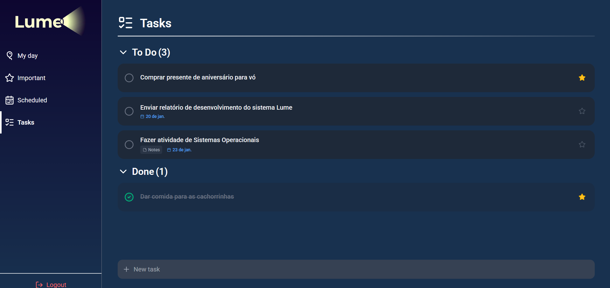

# 🌙 Lume – Frontend

<div align="center">
  
  <p><i>Gerenciamento de tarefas moderno, simples e focado em produtividade.</i></p>
</div>

<div align="center">


</div>

---

## 📌 Sobre o Projeto

O **Lume** é uma aplicação de lista de tarefas inspirada em ferramentas de alta produtividade como _Microsoft To Do_ e _Todoist_. O projeto foi desenvolvido com foco em uma interface limpa (Clean UI) e transições fluidas que não interrompem o fluxo de trabalho do usuário.

> **Importante:** Este repositório contém apenas o código do **Frontend**. Para que a aplicação funcione corretamente, você precisará do [Backend (API)](https://github.com/joaovardenski/Lume-back).

---

## ✨ Funcionalidades Principais

### 📝 Gestão de Tarefas

- **CRUD Completo:** Criar, visualizar, editar e excluir tarefas.
- **Priorização:** Destaque tarefas críticas marcando-as como **Importantes** (Estrela).
- **Agendamento:** Definição de prazos para melhor organização.
- **Conclusão Animada:** Marque tarefas como concluídas com feedback visual imediato.

### 🔍 Organização Inteligente (Smart Views)

- 📅 **My Day:** Visão focada nas tarefas do dia.
- ⭐ **Important:** Filtro para tarefas de alta prioridade.
- 🗓️ **Scheduled:** Planejamento de tarefas com datas definidas.
- 📦 **All Tasks:** Visão geral de todo o histórico.

### 🎨 Experiência do Usuário (UX)

- **Mobile First:** Interface totalmente responsiva e adaptada para dispositivos móveis.
- **Micro-interações:** Animações de entrada, saída e layout utilizando `Framer Motion`.
- **Dark Mode:** Design escuro nativo para reduzir o cansaço visual.

---

## 🛠️ Tecnologias Utilizadas

- **[React](https://reactjs.org/)** - Biblioteca base para a UI.
- **[TypeScript](https://www.typescriptlang.org/)** - Tipagem estática para maior segurança e produtividade.
- **[Vite](https://vitejs.dev/)** - Tooling de próxima geração para um desenvolvimento rápido.
- **[Tailwind CSS](https://tailwindcss.com/)** - Framework CSS utilitário para estilização moderna.
- **[Framer Motion](https://www.framer.com/motion/)** - Biblioteca para animações de componentes e layout.
- **[Lucide Icons](https://lucide.dev/)** - Pacote de ícones minimalistas.
- **[Axios](https://axios-http.com/)** - Cliente HTTP para integração com a API.

---

## 📁 Estrutura do Projeto

```text
src/features
├── api/        # Configurações do Axios e chamadas de serviço
├── assets/     # Arquivos estáticos (imagens, fontes)
├── components/ # Componentes reutilizáveis (TaskItem, Modais, Inputs)
├── contexts/   # Gerenciamento de estado global (Auth, Tasks)
├── hooks/      # Hooks personalizados para lógica de negócio
├── pages/      # Views principais da aplicação
├── types/      # Definições de interfaces TypeScript
└── utils/      # Helpers e funções de formatação (Datas, etc)
```

---

## ⚙️ Como Rodar o Projeto

### Pré-requisitos

- Node.js (v18 ou superior).
- NPM ou Yarn.

### Passo a passo 1 (usando no servidor)

#### Siga o link para o projeto rodando no servidor

```text
https://lume-front.vercel.app/
```

### Passo a passo 2 (modo desenvolvedor)

#### Clone o repositório

```text
git clone https://github.com/joaovardenski/Lume-front.git
cd Lume-front
```

#### Instale as dependências

```text
npm install
```

#### Configure a API (ajuste a rota da api em src/api/axios.ts)

```text
// Exemplo:
baseURL: 'http://localhost:3000'
```

#### Inicie o servidor de desenvolvimento

```text
npm run dev
```

---

## 👨‍💻 Autor

**João Victor Vardenski de Andrade** Estudante de Engenharia de Software.

<div align="center"> Desenvolvido com ❤️ por João Victor </div>
